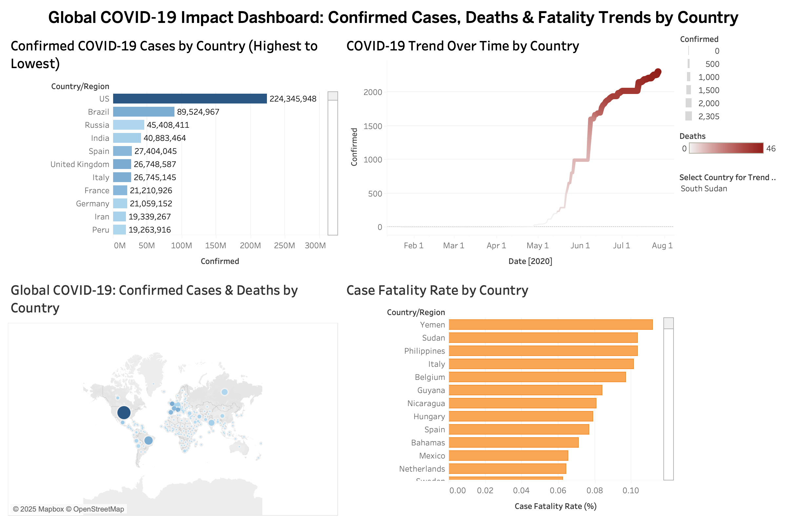

# 📊 Interactive COVID-19 Visualization Dashboard

This project is a Tableau-based interactive dashboard that explores the global impact of COVID-19 through:

- Confirmed cases by country
- Death trends over time
- Case fatality rates
- Global geospatial distribution

The dashboard allows you to **click on a country** and dynamically update all charts.

---

## 📁 Download Dashboard

▶️ [Covid 19 Cases.twbx](Covid%2019%20Cases.twbx)

You can open this file directly in [Tableau Desktop](https://www.tableau.com/products/desktop) to explore or customize the dashboard.

---

## 🖼️ Dashboard Preview

---

## ✨ Features

- Click on a country to filter all charts dynamically
- View case fatality rate comparisons
- Explore trends over time and geographic impact

## 💡 Tools Used

- **Tableau Desktop**
- Public COVID-19 datasets (from sources like Kaggle / JHU)

---

## 👤 Author

**Sonu Tamang**  
📍 Newark, NJ  
🔗 [LinkedIn](https://www.linkedin.com/in/sonu-tamang) | 📧 sonulama778@gmail.com  
